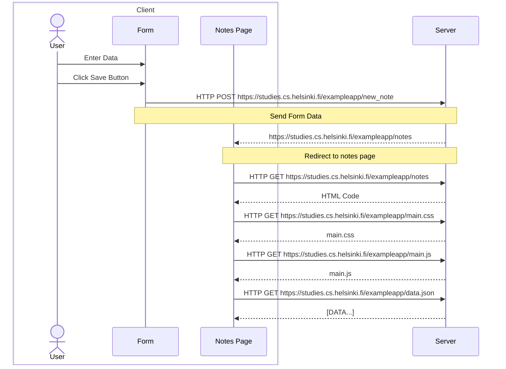

# User create a new note

## Sequence diagram

```mermaid
sequenceDiagram
    box Client
    actor User
    participant Form
    participant Notes Page
    end
    User->>Form: Enter Data
    User->>Form: Click Save Button
    Form->>Server: HTTP POST https://studies.cs.helsinki.fi/exampleapp/new_note
    Note over Form,Server: Send Form Data
    Server-->>Notes Page: https://studies.cs.helsinki.fi/exampleapp/notes
    Note over Server,Notes Page: Redirect to notes page
    Notes Page ->>Server: HTTP GET https://studies.cs.helsinki.fi/exampleapp/notes
    Server-->>Notes Page: HTML Code
    Notes Page ->>Server: HTTP GET https://studies.cs.helsinki.fi/exampleapp/main.css
    Server-->>Notes Page: main.css
    Notes Page ->>Server: HTTP GET https://studies.cs.helsinki.fi/exampleapp/main.js
    Server-->>Notes Page: main.js
    Notes Page ->>Server: HTTP GET https://studies.cs.helsinki.fi/exampleapp/data.json
    Server-->>Notes Page: [DATA...]
```
