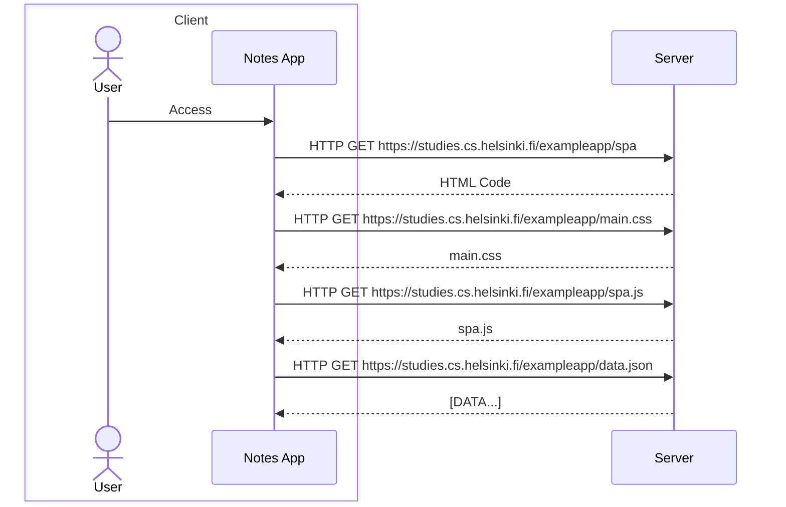

# User access to SPA

## Sequence diagram

```mermaid
sequenceDiagram
    box Client
    actor User
    participant Notes App
    end
    User->>Notes App: Access
    Notes App ->>Server: HTTP GET https://studies.cs.helsinki.fi/exampleapp/spa
    Server-->>Notes App: HTML Code
    Notes App ->>Server: HTTP GET https://studies.cs.helsinki.fi/exampleapp/main.css
    Server-->>Notes App: main.css
    Notes App ->>Server: HTTP GET https://studies.cs.helsinki.fi/exampleapp/spa.js
    Server-->>Notes App: spa.js
    Notes App ->>Server: HTTP GET https://studies.cs.helsinki.fi/exampleapp/data.json
    Server-->>Notes App: [DATA...]
```
