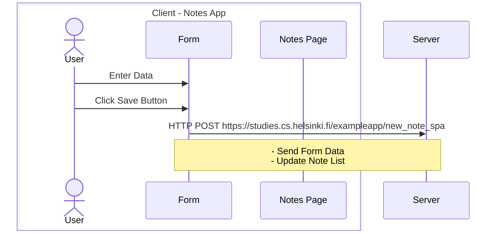

# User create a new note in SPA

## Sequence diagram

```mermaid
sequenceDiagram
    box Client - Notes App
    actor User
    participant Form
    participant Notes Page
    end
    User->>Form: Enter Data
    User->>Form: Click Save Button
    Form->>Server: HTTP POST https://studies.cs.helsinki.fi/exampleapp/new_note_spa
    Note over Form,Server: - Send Form Data <br/> - Update Note List
```
